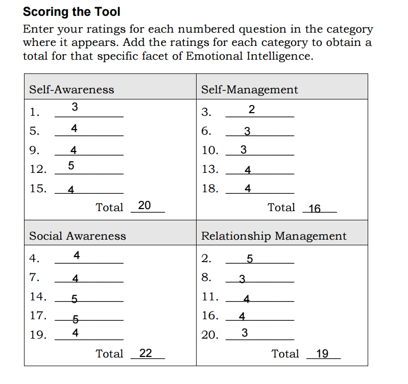
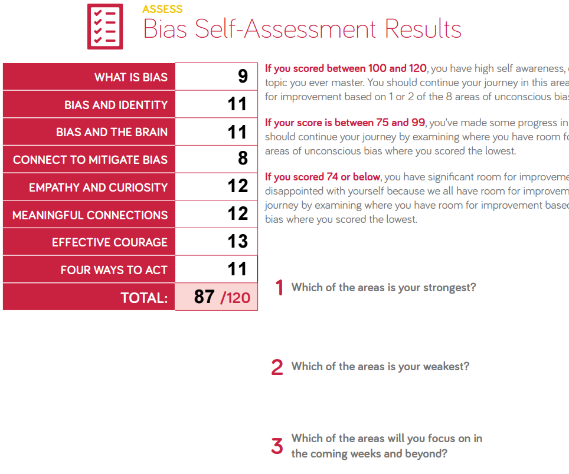

# Reading Notes
## Upgrade your technical skills with deliberate practice

What I understood from this page is that a developer should always seek to learn new things and practices and that can only happen if you suffer and struggle through it because if one feels too comfortable in a zone then something is definitely wrong. A change is not always a bad thing, sometimes change is the best one can have. finally one should enjoy the journey more than the finishing the race!

## The power of believing that you can improve
What i understood from this video is that people should look at things in a different perspective. Challenge is not a bad thing and when you feel that are struggling in solving something, that doesn't mean you are dumb or untalented because those don't matter. What matters is the for you to look at it as a process to get there (Not Yet) not an instantous goal. With time and the right thinking everything is possible thats the power of Not Yet. 

## Grit: The power of passion and perseverance
What this one is talking about is that the power of someone comes from how they address things and how they look at them and at which perspective no matter their IQ or how smart they are. Having a solid image of how a mind can evolve through tough and challenging situations make improving it sounds somewhat existent and not impossible. If you have the Grit and the determination to do this growth and think of it as a marathon not a sprint then you are one step closer to achieving your goals.

## A kinder, gentler philosophy of success
What i grasped from this talk is that one's essence is measured wrongly, not everyone who has had a failure in life means they are losers and not everyone who has had a success in life means they are winners. which might make people envious of the winners on things they see as i could have done this as well and then start blaming themselves for their mistakes and failures, which would eventually destroy one's life. also Alain de Batton stresses deeply that a person should seek in life what they really want not what people think is respected and is best. 

-------------------------------------------------------------

## EMOTIONAL INTELLIGENCE SELF-ASSESSMENT TOOL 
I have found out that i really need to re-assess my emotions and how i can control them. I need to find another persepective of how i look at obstacles in my life and how to adress them. my problem might not be that something is too difficult, sometimes i tend to overcomplicate stuff. out of ignoreness maybe or out of anxiousness. Though i think it is a normal thing to feel about this big shift.

--------------------------------------------------------------

## Bias Self-Assessment

As it appears my strongest area is effective courage and my weakest is Mitigate BIAS although i think i am a well rounded person, imporvements are  still needed. I for one am not Biased and believe in fair chances to all.

