# SQL Reading Notes

SQL is an abbreviation of the word Structured Query Language.

Table Data taken from [W3Schools](https://www.w3schools.com/sql/default.asp) 

| Syntax      | Description | Test Text     |
| :---        |    :----:   |          :---: |
| SELECT     | extracts data from a database       | SELECT column1,column2, ... FROM table_name;   |
| UPDATE   | updates data in a database        | UPDATE table_name SET column1 = value1, column2 = value2, ...WHERE condition;      |
| DELETE    | deletes data from a database        | DELETE FROM table_name WHERE condition;      |
| INSERT INTO   | inserts new data into a database        | INSERT INTO table_name (column1, column2, column3, ...) VALUES (value1, value2, value3, ...);      |
| CREATE DATABASE   | creates a new database        | CREATE DATABASE databasename;      |
| DROP DATABASE   | drops a database        | DROP DATABASE databasename;      |

- CREATE TABLE : creates a new table 
 ```
CREATE TABLE table_name (
    column1 datatype,
    column2 datatype,
    column3 datatype,
   ....
)
```
- ATLER TABLE : modifies a table

```
ALTER TABLE table_name
ADD column_name datatype;
``` 

- DROP TABLE : deletes a table
`DROP TABLE table_name;`   

### Things to look out for:
-  SQL is case insensitive, the reason for CAPS is to distinguish the commands from the data
-  A semicolon is a must at the end of the query (;).
-  Table and column names must start with a letter and not a number.

The../assetstures are taken from [sqlbolt](https://sqlbolt.com/lesson/select_queries_with_constraints_pt_2)

### Optional keyword arguments: with **Select**
 
**Where conditon**: a condition statement which help reduce the number of search results in the../assetsture below you can see conditional operators used with where <br>
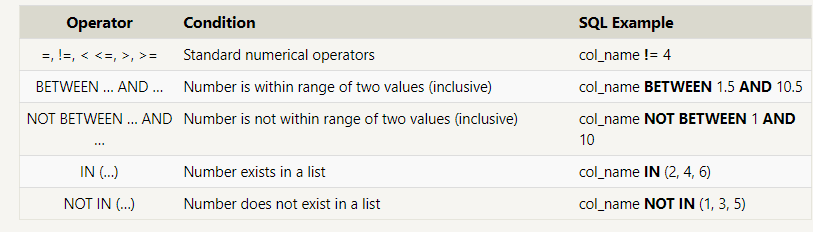 
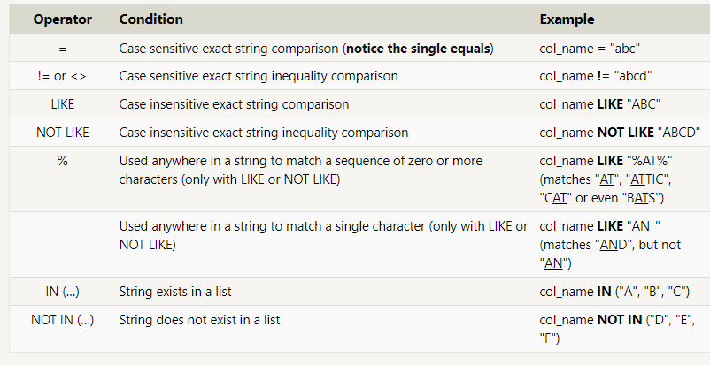
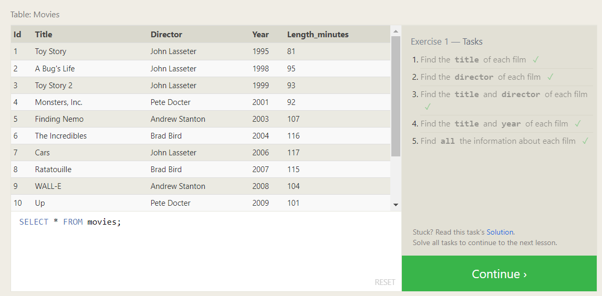
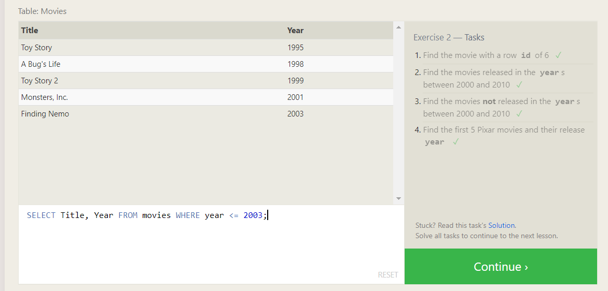
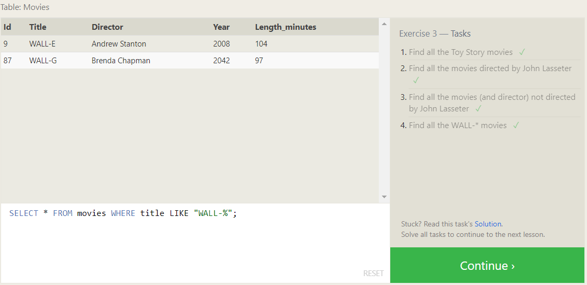

**Distinct** : shows only unique data with no duplicates <br>
**ORDER BY column ASC/DESC** : orders the results Ascending or Descending.<br>
**LIMIT num_limit OFFSET num_offset** : often used with Order by keyword and the limit reduces the number of results and the offset sets where to start giving results(number).<br>
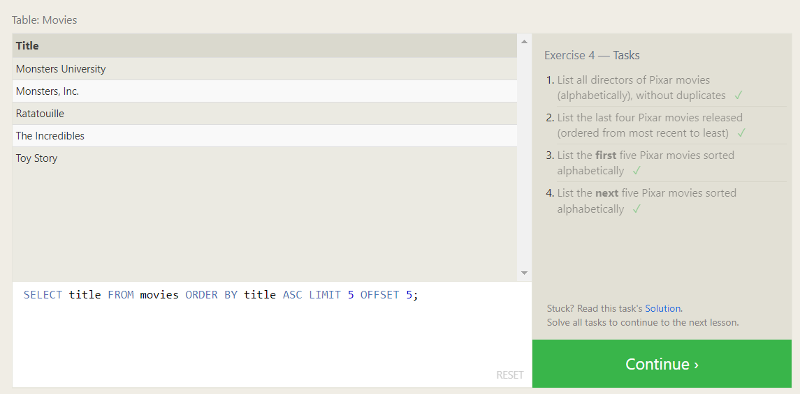
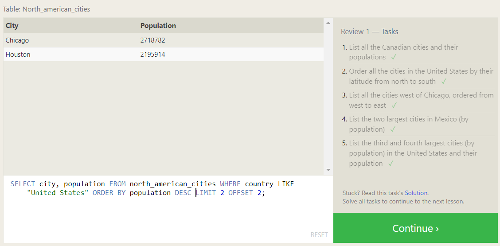
 **JOIN or INNER JOIN**: Using the JOIN clause in a query, we can combine row data across two separate tables using a unique key which is mostly the id.
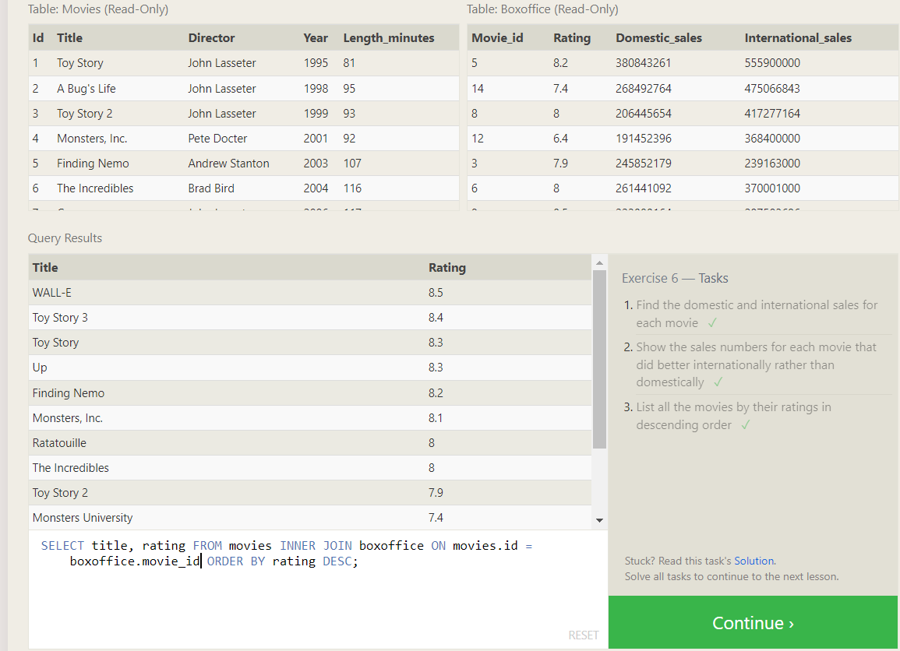

-------------------------------------------

### INSERT INTO: 

To insert data into a database, we need to use an INSERT statement, which declares which table to write into, the columns of data that we are filling, and one or more rows of data to insert. In general, each row of data you insert should contain values for every corresponding column in the table. You can insert multiple rows at a time by just listing them <br>

Insert statement with specific columns <br>
``` 
INSERT INTO mytable
(column, another_column, …)
VALUES (value_or_expr, another_value_or_expr, …),
(value_or_expr_2, another_value_or_expr_2, …),
```
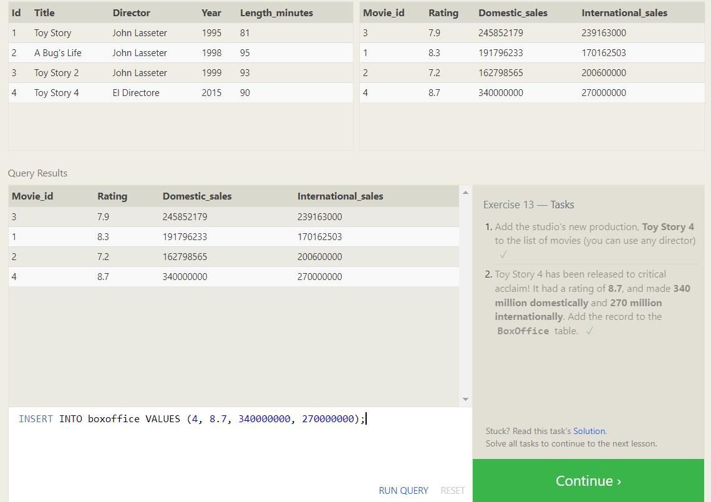

-------------------------------------------
### UPDATE: 
It is used when you need to edit something in your table but be warn that you should first try using SELECT query to make sure you have the right data you want to update before switching to UPDATE.

```
Update statement with values
UPDATE mytable
SET column = value_or_expr, 
    other_column = another_value_or_expr, 
    …
WHERE condition;
```
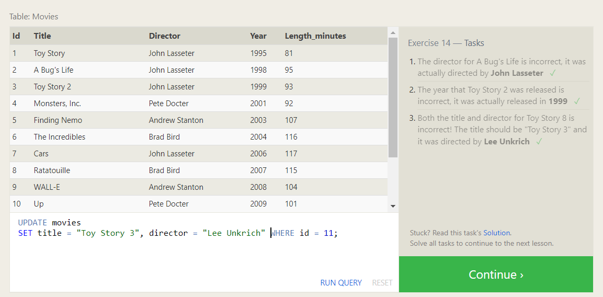

-------------------------------------------

### Deleting rows: 
BE AWARE: to take caution when deleting rows from the table by first using SELECT query before switching to delete to prevent mistakes.
```
DELETE FROM mytable
WHERE condition;
```
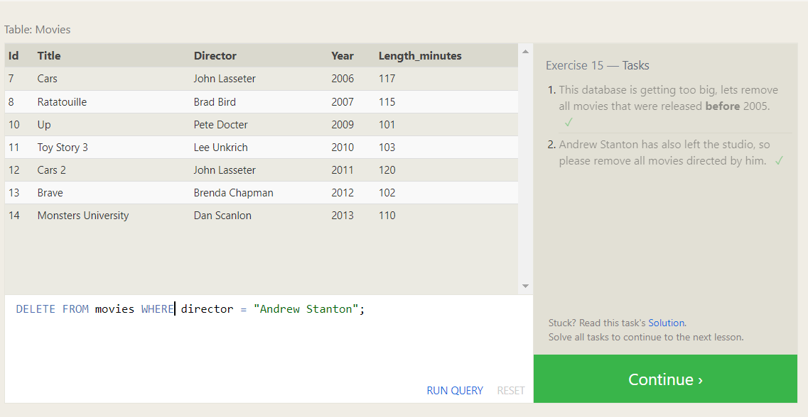

-------------------------------------------

### Creating tables: 
We create a table by creating a schema and put the syntax below.
```
CREATE TABLE IF NOT EXISTS mytable (
    column DataType TableConstraint DEFAULT default_value,
    another_column DataType TableConstraint DEFAULT default_value,
    …
);
```
**IF NOT EXISTS** will check first if the table exist and if not it will create a new one.

There are several different types of data
 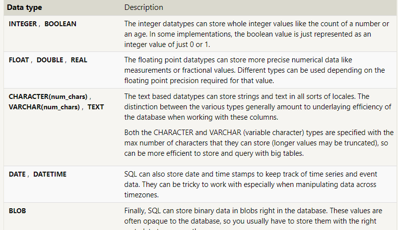

as well as types of constraints to connect to other tables
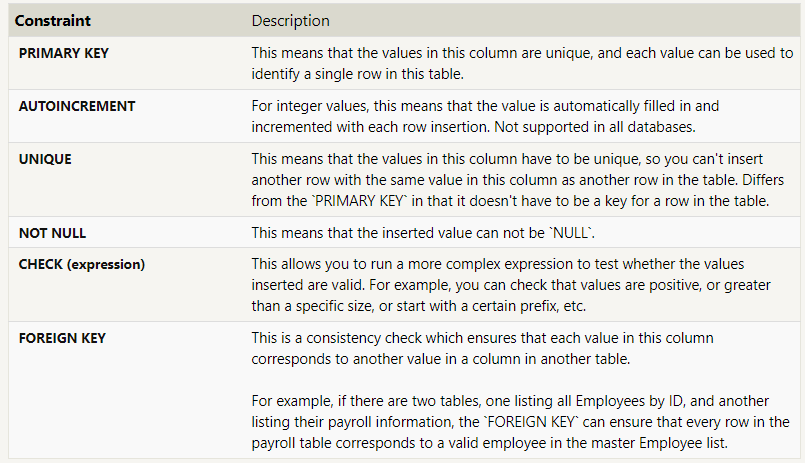
Here is an example:
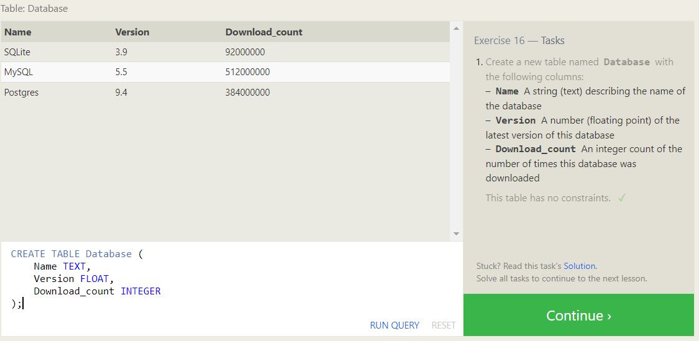

------------------------------------------------

### Altering tables:
It can be used to modify the table by deleting columns or adding new columns or other...

- Adding a new column:
```
ALTER TABLE mytable
ADD column DataType OptionalTableConstraint 
    DEFAULT default_value;
```
- Removing  a column:

```
ALTER TABLE mytable
DROP column_to_be_deleted;
```

- Renaming  table:
```
ALTER TABLE mytable
RENAME TO new_table_name;
```

General Example: 
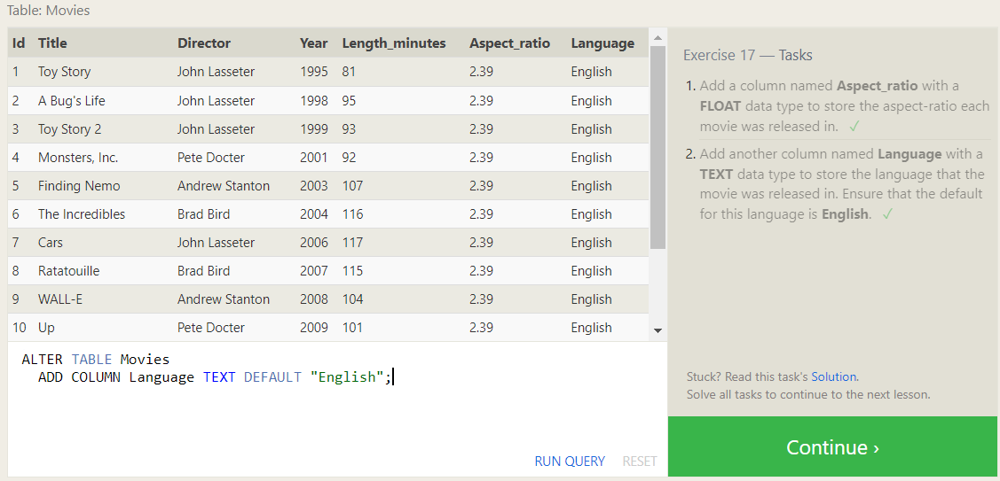


--------------------------------------------

### Dropping tables:
It differs from delete is that drop removes the entire table from the schema 

```
DROP TABLE IF EXISTS mytable;
```
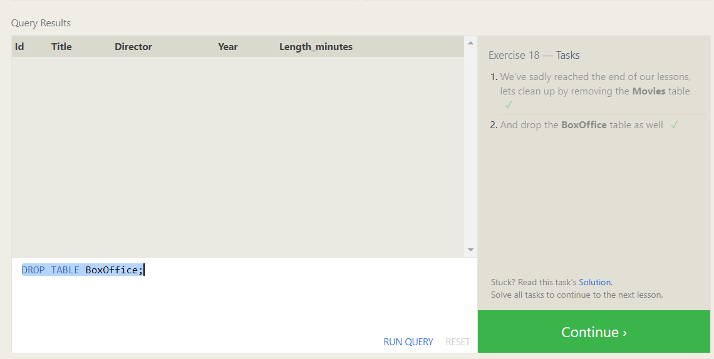